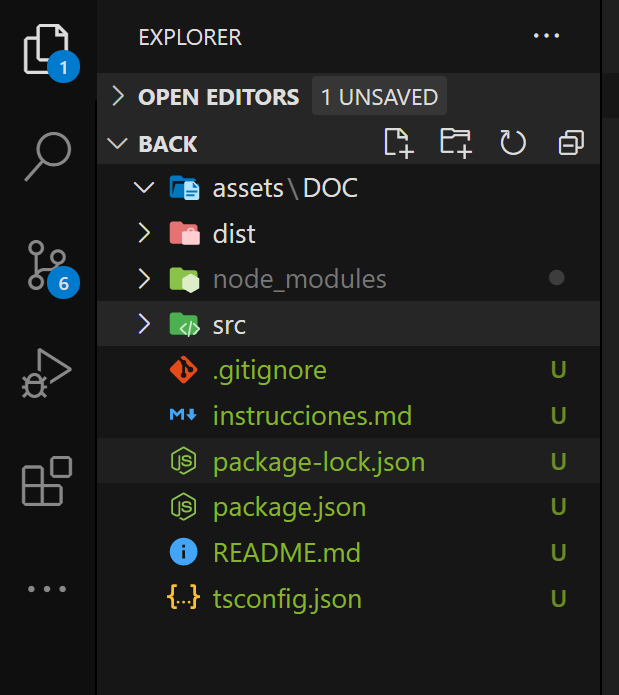
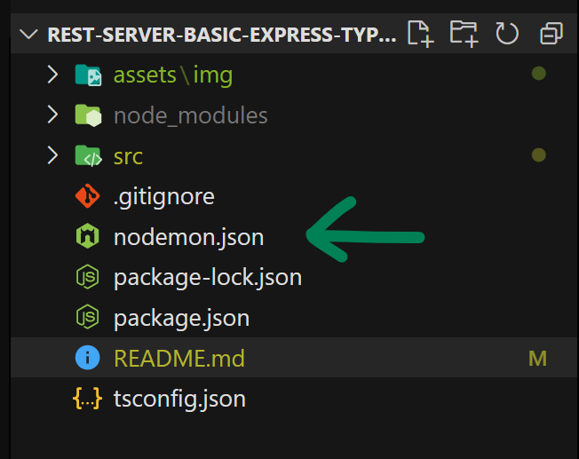
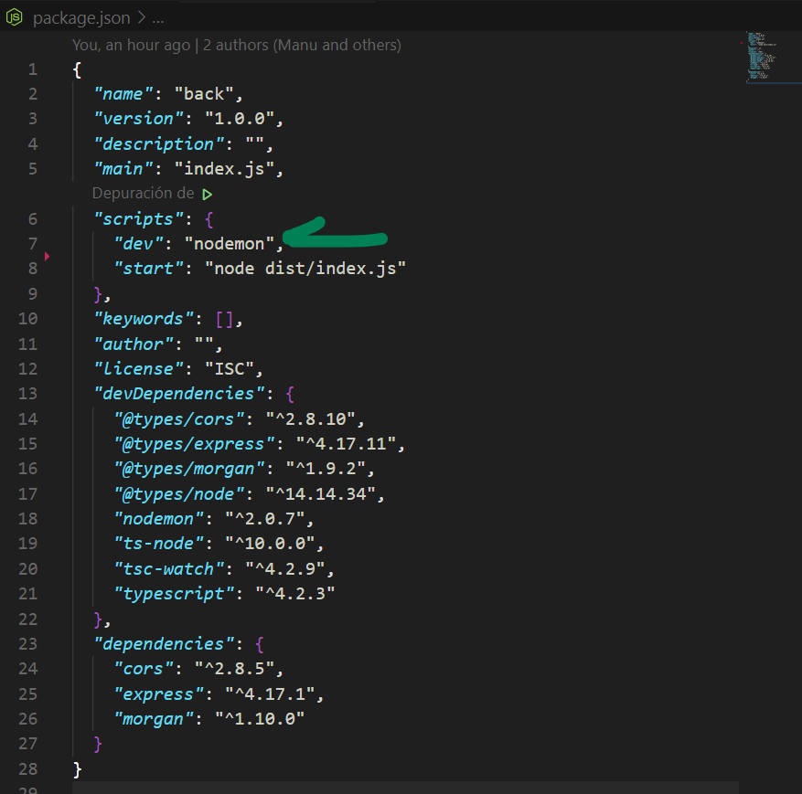
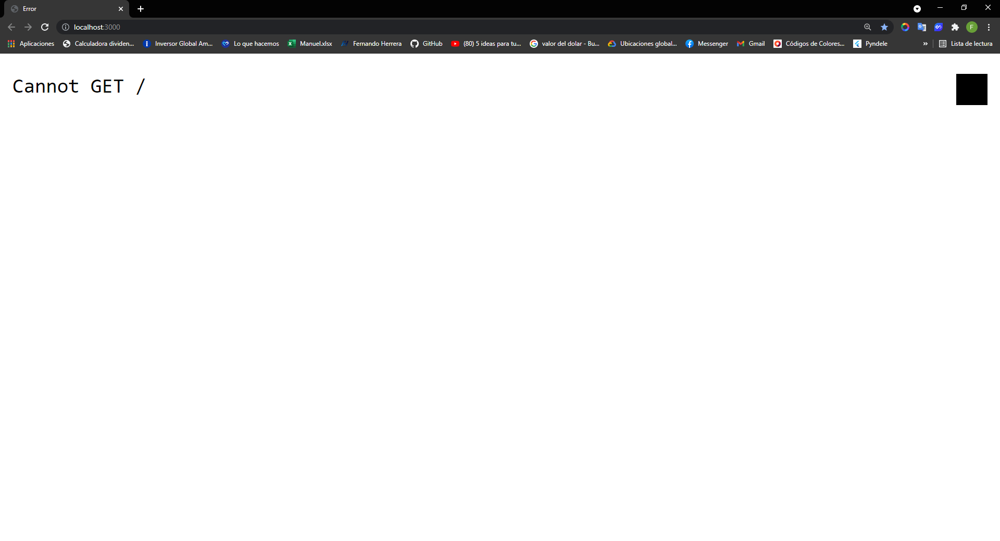
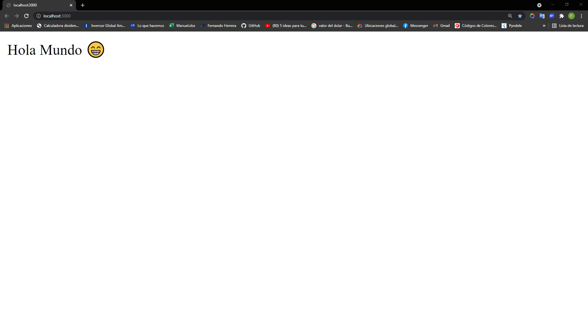

# Pasos a replicar el proyecto - 11/03/21

## Crear API REST

primero se deben instalar las dependencias iniciales necesarias, luego instalaremos más dependencias en lo que profundicemos

### Dependencias de desarrollo
* @types/express
* @types/cors
* @types/morgan 
* @types/node
* typescript
* nodemon
* ts-node
```
npm i -D @types/cors @types/express @types/morgan @types/node tsc-watch typescript ts-node nodemon
```

### Dependencias de producción 
* cors
* express
* morgan
```
npm i cors express morgan
```
 
Descripción corta de cada paquete

* `"cors"` permite que cualquier url pueda solicitar datos a nuestro servidor [Link para mas info](https://www.npmjs.com/package/cors)

* `"express"` permite crear un servidor minimalista pero poderoso [Link para mas info](https://www.npmjs.com/package/express)

* `"morgan"` permite hacer logs automáticos de las peticiones que se hacen [Link para mas info](https://www.npmjs.com/package/morgan)

* `"typescript"` permite hacer código tipado y provee `intellisense` característica que puede reducir los errores de escritura de funciones, métodos ... [Link para mas info](https://www.npmjs.com/package/typescript)

* `"ts-node"` lo utilizaremos para ejecutar `TypeScript` directamente en `Node` [Link para mas info](https://www.npmjs.com/package/ts-node)

* `"nodemon"` lo utilizaremos para reiniciar el servidor cada vez que haya un cambio en el código [Link para mas info](https://www.npmjs.com/package/nodemon)

* `"@types/..." ` son los tipados de cada paquete
___

Después de instalar las dependencias se iniciara el proyecto en `TypeScript`, se debe ejecutar el siguiente comando `tsc --init`  para hacer un par de configuraciones iniciales, las configuraciones en `tsconfig.json` se van a hacer de forma progresiva de forma que se entienda para que sirve cada cambio en dicho archivo 

### Paso 1
Cambiar de 
```json
"target": "es5",
```
a 
```json
"target": "es6",
```

Esta linea indica que el código escrito en `TypeScript` se convertirá a la version de `JavaScript` mencionada [LINK DE REFERENCIA A LA DOC](https://www.typescriptlang.org/tsconfig#target)

___

### Paso 2
Cambiar de 
```json
"lib": [],
"lib": ["ES5", "ES6"],
```
a
```json
"lib": [],
"lib": ["ES5", "ES6"],
```

Esta línea hace referencia a las 
características que se usara de `JavaScript` [LINK DE REFERENCIA A LA DOC](https://www.typescriptlang.org/tsconfig#lib)
___
### Paso 3
Cambiar de 
```json
//  "outDir": "./",
//  "rootDir": "./",
```
a
```json
"outDir": "./dist",
"rootDir": "./src",
```
Esta linea busca el código de `TypeScript` en `./src`, luego `Transpila`( `Traducir`, `Compilar`... son términos validos pero estrictamente es `Transpilar`, si quiere conocer la diferencia le dejo el [Enlace](https://ingenieriadesoftware.es/diferencia-transpilacion-compilacion/) ) el código a `JavaScript` y lo guarda en `./dist`

[LINK DE REFERENCIA DE `outDir` EN A LA DOC](https://www.typescriptlang.org/tsconfig#outDir)

[LINK DE REFERENCIA DE `rootDir` EN A LA DOC](https://www.typescriptlang.org/tsconfig#rootDir)


___

### Paso 4
Cambiar de 
```json
"strictPropertyInitialization": true,
```
a

```json
"strictPropertyInitialization": false,
```

Esta linea hace referencia a que no es obligatorio inicializar una propiedad dentro de una clase [LINK DE REFERENCIA EN A LA DOC](https://www.typescriptlang.org/tsconfig#strictPropertyInitialization)

___

### Paso 5
Cambiar de 
```json
//"moduleResolution": "node",
```
a
```json
"moduleResolution": "node",
```
[LINK DE REFERENCIA DE ROOTDIR EN A LA DOC](https://www.typescriptlang.org/tsconfig#moduleResolution)

Esta linea hace referencia a una estrategia que aplica TypeScript para el reconocimiento de rutas
___

### Paso 6

Ahora empezaremos a crear la estructura, en la carpeta raíz se deberá crear 2 carpetas

``` 
root-|
     |-dist
     |-src
```

En mi editor de código "VS Code" se vería así 



La carpeta `./src` contendrá el código de `TypeScript`, y la carpeta `./dist` sera la [`Transpiración`](https://ingenieriadesoftware.es/diferencia-transpilacion-compilacion/) a JavaScript

Dentro de la carpeta `./src` crearemos con un archivo `server.ts`, el path se vería asi `./src/server.ts`

Luego crearemos una clase para trabajar el servidor con POO

```ts
import express from 'express';
import morgan from 'morgan';
import cors from 'cors';
import { Router } from 'express';

interface Constructor {
  port: string | number 
  routes?: Router[]
}

export default class Server {

  public app = express();

  constructor({
      routes,
      port 
  } : Constructor ) {
      
      this.app.use( cors() );
      this.app.use( morgan('dev') );
      this.app.use( express.json() );
  
      this.app.listen( port, () => {
          console.log(`Server at http://localhost:${ port }`)
      })

      if (routes) {
          this.app.use(...routes)
      }

  }

}
```

Bueno, aquí hay un par de cosas nuevas, normalmente uno quiere subir la aplicación `Node` a un hosting y ese hosting puede exponer un puerto para que el servidor lo utilice, pero claro, no queremos cambiar de forma constante entre modo desarrollo y modo producción

Para eso dentro de la clase `Server` creamos un `argumento nombrado obligatorio` llamado `port`

Para explicarlo mejor, crearemos un fichero llamado `index.ts` dentro de `./src`, el path seria asi `./src/index.ts`

luego de crear el fichero `index.ts` llamaremos la clase `Server`
```ts
import Server from './server';

new Server({
    port: process.env.PORT || 3000,
});

```
`port: process.env.PORT || 3000;` esto funciona asi

Si `port: process.env.PORT` existe entonces estamos en modo producción, si no existe utilizara el puerto `3000` que hare referencia a que se esta ejecutando localmente o que el hosting no tiene un puerto asignado a app de `Node` como suele ser el caso de algunos `Cpanel` 


Para arrancar el servidor existen muchas formas, pero comenzare con la mas fácil

`npx ts-node src/index.ts`

Esto [`Transpila`](https://ingenieriadesoftware.es/diferencia-transpilacion-compilacion/) el código de `TypeScript` a `JavaScript` y ejecuta el servidor


y debería salir un mensaje como este en consola 
``` 
D:\Rest-Server-Basic-Express-TypeScript> npx ts-node src/index.ts
Server at http://localhost:3000
```

Ahora si si modificamos el código y queremos ver los cambios tenemos que bajar el servidor y volverlo a levantar, para evitar esto utilizaremos la dependencia `nodemon` 

En la raíz del proyecto crearemos un archivo llamado `nodemon.json`




Y dentro escribiremos lo siguiente 

``` json
{
  "ext": "ts, js, hbs",
  "watch":[ "src" ],
  "ignore":[ "" ],
  "exec":"ts-node ./src/index.ts"
}
```

Esto dice lo siguiente

`"ext": "ts, js, hbs",` esto escucha los cambios en las extensiones ...

`"watch":[ "src" ],` esto escucha los cambios en carpetas especificas ...

`"ignore":[ "" ],` esto ignora los cambios en carpetas especificas ...

`"exec":"ts-node ./src/index.ts"` esto ejecuta el script cada vez que haya un cambio

Ahora debemos correr el servidor con los cambios hechos, en la consola escribiremos 

`npx nodemon` 

y responderá con un mensaje parecido a este 

```
PS D:\Rest-Server-Basic-Express-TypeScript> npx nodemon src/index.ts
[nodemon] 2.0.7
[nodemon] to restart at any time, enter `rs`
[nodemon] watching path(s): src\**\* views
[nodemon] watching extensions: ts,js,hbs
[nodemon] starting `ts-node ./src/index.ts src/index.ts`
Server at http://localhost:3000
```

Asi como esta funciona perfectamente pero puede cansar tener que recordar el comando, para eso podemos crear un script personalizado en `package.json` que se vería asi



Ahora con ejecutar el script 

`npm run dev`

y responderá con un mensaje parecido a este 
```
PS D:\Rest-Server-Basic-Express-TypeScript> npm run dev
> back@1.0.0 dev D:\Rest-Server-Basic-Express-TypeScript
> nodemon
[nodemon] 2.0.7
[nodemon] to restart at any time, enter `rs`
[nodemon] watching path(s): src\**\* views  
[nodemon] watching extensions: ts,js,hbs    
[nodemon] starting `ts-node ./src/index.ts` 
Server at http://localhost:3000

```

En este momento el servidor ya deberia responder un mensaje como este 



Ahora debemos agregarle las rutas, ya sea para una `Web server` o una `API Rest`

Para agregar las rutas debemos crear 2 carpetas dentro de `/src` que serian `/src/controller` y `/src/router` 

Comenzaremos en la carpeta `/src/controller` y crearemos un archivo con el nombre `/src/controller/controller.ts`

El código en `"controller.ts"` quedaría así:
```ts
import { Request, Response } from 'express';

export const getRoot = async ( req: Request, res: Response) : Promise<Response> => {
 
    return res.send('Hola Mundo 😁')
}
```
`/src/controller/controller.ts` se encargara de manejar la lógica de cada ruta


Ahora vamos a por la carpeta `/src/router` y crearemos un archivo con el nombre `/src/router/router.ts`

El código de `"router.ts"` quedaría así:

``` ts
import { Router } from 'express'
import { getRoot } from '../controller/controller';

const router = Router();

router.get(
    /* Nombre de ruta -->*/ '/', 
    [ /* Array de middlewares*/ ],  
    /* Controller -->*/ getRoot 
);

export default router;
```

se encargara de declarar las rutas y adicionar `Middleware` que se necesiten, mas adelante mostrare un par de ejemplos de ese tal `Middleware`


Ahora hay que decirle a nuestra clase `Server` que utilize las rutas

Y el código se vería así:

``` ts
import routes from './router/router';
import Server from './server';

new Server({
    port: process.env.PORT || 3000,
    routes: [
        routes
    ]
});
```
Y listo, solo toca acceder a la dirección que aparece en la consola, que en mi caso es `Server at http://localhost:3000`, si todo sale bien deberíamos ver este mensaje




