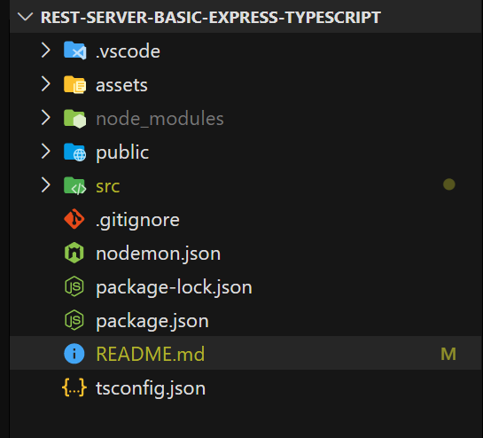

# Pasos a replicar el proyecto - 11/03/21

## Crear API REST

primero se deben instalar las dependencias iniciales necesarias, luego instalaremos más dependencias en lo que profundicemos

### Dependencias de desarrollo
* @types/express
* @types/cors
* @types/morgan 
* @types/node
* typescript
* nodemon
* ts-node
```
npm i -D @types/cors @types/express @types/morgan @types/node tsc-watch typescript ts-node nodemon
```

### Dependencias de producción 
* cors
* express
* morgan
```
npm i cors express morgan
```
 
Descripción corta de cada paquete

* `"cors"` permite que cualquier url pueda solicitar datos a nuestro servidor [Link para mas info](https://www.npmjs.com/package/cors)

* `"express"` permite crear un servidor minimalista pero poderoso [Link para mas info](https://www.npmjs.com/package/express)

* `"morgan"` permite hacer logs automáticos de las peticiones que se hacen [Link para mas info](https://www.npmjs.com/package/morgan)

* `"typescript"` permite hacer código tipado y provee `intellisense` característica que puede reducir los errores de escritura de funciones, métodos ... [Link para mas info](https://www.npmjs.com/package/typescript)

* `"ts-node"` lo utilizaremos para ejecutar `TypeScript` directamente en `Node` [Link para mas info](https://www.npmjs.com/package/ts-node)

* `"nodemon"` lo utilizaremos para reiniciar el servidor cada vez que haya un cambio en el código [Link para mas info](https://www.npmjs.com/package/nodemon)

* `"@types/..." ` son los tipados de cada paquete
___

Después de instalar las dependencias se iniciara el proyecto en `TypeScript`, se debe ejecutar el siguiente comando `tsc --init`  para hacer un par de configuraciones iniciales, las configuraciones en `tsconfig.json` se van a hacer de forma progresiva de forma que se entienda para que sirve cada cambio en dicho archivo 

### Paso 1
Cambiar de 
```json
"target": "es5",
```
a 
```json
"target": "es6",
```

Esta linea indica que el código escrito en `TypeScript` se convertirá a la version de `JavaScript` mencionada [LINK DE REFERENCIA A LA DOC](https://www.typescriptlang.org/tsconfig#target)

___

### Paso 2
Cambiar de 
```json
"lib": [],
"lib": ["ES5", "ES6"],
```
a
```json
"lib": [],
"lib": ["ES5", "ES6"],
```

Esta línea hace referencia a las 
características que se usara de `JavaScript` [LINK DE REFERENCIA A LA DOC](https://www.typescriptlang.org/tsconfig#lib)
___
### Paso 3
Cambiar de 
```json
//  "outDir": "./",
//  "rootDir": "./",
```
a
```json
"outDir": "./dist",
"rootDir": "./src",
```
Esta linea busca el código de `TypeScript` en `./src`, luego `Transpila`( `Traducir`, `Compilar`... son términos validos pero estrictamente es `Transpilar`, si quiere conocer la diferencia le dejo el [Enlace](https://ingenieriadesoftware.es/diferencia-transpilacion-compilacion/) ) el código a `JavaScript` y lo guarda en `./dist`

[LINK DE REFERENCIA DE `outDir` EN A LA DOC](https://www.typescriptlang.org/tsconfig#outDir)

[LINK DE REFERENCIA DE `rootDir` EN A LA DOC](https://www.typescriptlang.org/tsconfig#rootDir)


___

### Paso 4
Cambiar de 
```json
"strictPropertyInitialization": true,
```
a

```json
"strictPropertyInitialization": false,
```

Esta linea hace referencia a que no es obligatorio inicializar una propiedad dentro de una clase [LINK DE REFERENCIA EN A LA DOC](https://www.typescriptlang.org/tsconfig#strictPropertyInitialization)

___

### Paso 5
Cambiar de 
```json
//"moduleResolution": "node",
```
a
```json
"moduleResolution": "node",
```
[LINK DE REFERENCIA DE ROOTDIR EN A LA DOC](https://www.typescriptlang.org/tsconfig#moduleResolution)

Esta linea hace referencia a una estrategia que aplica TypeScript para el reconocimiento de rutas
___

### Paso 6

Ahora empezaremos a crear la estructura, en la carpeta raíz se deberá crear 2 carpetas

``` 
root-|
     |-dist
     |-src
```

En mi editor de código "VS Code" se vería así 


La carpeta `./src` contendrá el código de `TypeScript`, y la carpeta `./dist` sera la [`Transpiración`](https://ingenieriadesoftware.es/diferencia-transpilacion-compilacion/) a JavaScript

Dentro de la carpeta `./src` crearemos con un archivo `server.ts`, el path se vería asi `./src/server.ts`

Luego crearemos una clase para trabajar el servidor con POO

```ts
import express from 'express';
import morgan from 'morgan';
import cors from 'cors';
import { Router } from 'express';

interface Constructor {
  port: string | number 
  routes?: Router[]
}

export default class Server {

  public app = express();

  constructor({
      routes,
      port 
  } : Constructor ) {
      
      this.app.use( cors() );
      this.app.use( morgan('dev') );
      this.app.use( express.json() );
  
      this.app.listen( port, () => {
          console.log(`Server at http://localhost:${ port }`)
      })

      if (routes) {
          this.app.use(...routes)
      }

  }

}
```

Bueno, aquí hay un par de cosas nuevas, normalmente uno quiere subir la aplicación `Node` a un hosting y ese hosting puede exponer un puerto para que el servidor lo utilice, pero claro, no queremos cambiar de forma constante entre modo desarrollo y modo producción

Para eso dentro de la clase `Server` creamos un `argumento nombrado obligatorio` llamado `port`

Para explicarlo mejor, crearemos un fichero llamado `index.ts` dentro de `./src`, el path seria asi `./src/index.ts`

luego de crear el fichero `index.ts` llamaremos la clase `Server`
```ts
import Server from './server';

new Server({
    port: process.env.PORT || 3000,
});

```
`port: process.env.PORT || 3000;` esto funciona asi

Si `port: process.env.PORT` existe entonces estamos en modo producción, si no existe utilizara el puerto `3000` que hare referencia a que se esta ejecutando localmente o que el hosting no tiene un puerto asignado a app de `Node` como suele ser el caso de algunos `Cpanel` 


Para arrancar el servidor existen muchas formas, pero comenzare con la mas fácil

`npx ts-node src/index.ts`

Esto [`Transpila`](https://ingenieriadesoftware.es/diferencia-transpilacion-compilacion/) el código de `TypeScript` a `JavaScript` y ejecuta el servidor


y debería salir un mensaje como este en consola 
``` 
D:\Rest-Server-Basic-Express-TypeScript> npx ts-node src/index.ts
Server at http://localhost:3000
```

Ahora si si modificamos el código y queremos ver los cambios tenemos que bajar el servidor y volverlo a levantar, para evitar esto utilizaremos la dependencia `nodemon` 

En la raíz del proyecto crearemos un archivo llamado `nodemon.json`


Y dentro escribiremos lo siguiente 

``` json
{
  "ext": "ts, js, hbs",
  "watch":[ "src" ],
  "ignore":[ "" ],
  "exec":"ts-node ./src/index.ts"
}
```

Esto dice lo siguiente

`"ext": "ts, js, hbs",` esto escucha los cambios en las extensiones ...

`"watch":[ "src" ],` esto escucha los cambios en carpetas especificas ...

`"ignore":[ "" ],` esto ignora los cambios en carpetas especificas ...

`"exec":"ts-node ./src/index.ts"` esto ejecuta el script cada vez que haya un cambio

Ahora debemos correr el servidor con los cambios hechos, en la consola escribiremos 

`npx nodemon` 

y responderá con un mensaje parecido a este 

```
PS D:\Rest-Server-Basic-Express-TypeScript> npx nodemon src/index.ts
[nodemon] 2.0.7
[nodemon] to restart at any time, enter `rs`
[nodemon] watching path(s): src\**\* views
[nodemon] watching extensions: ts,js,hbs
[nodemon] starting `ts-node ./src/index.ts src/index.ts`
Server at http://localhost:3000
```

Asi como esta funciona perfectamente pero puede cansar tener que recordar el comando, para eso podemos crear un script personalizado en `package.json` que se vería asi


Ahora con ejecutar el script 

`npm run dev`

y responderá con un mensaje parecido a este 
```
PS D:\Rest-Server-Basic-Express-TypeScript> npm run dev
> back@1.0.0 dev D:\Rest-Server-Basic-Express-TypeScript
> nodemon
[nodemon] 2.0.7
[nodemon] to restart at any time, enter `rs`
[nodemon] watching path(s): src\**\* views  
[nodemon] watching extensions: ts,js,hbs    
[nodemon] starting `ts-node ./src/index.ts` 
Server at http://localhost:3000

```

En este momento el servidor ya deberia responder un mensaje como este 


Ahora debemos agregarle las rutas, ya sea para una `Web server` o una `API Rest`

Para agregar las rutas debemos crear 2 carpetas dentro de `/src` que serian `/src/controller` y `/src/router` 

Comenzaremos en la carpeta `/src/controller` y crearemos un archivo con el nombre `/src/controller/controller.ts`

El código en `"controller.ts"` quedaría así:
```ts
import { Request, Response } from 'express';

export const getRoot = async ( req: Request, res: Response) : Promise<Response> => {
 
    return res.send('Hola Mundo 😁')
}
```
`/src/controller/controller.ts` se encargara de manejar la lógica de cada ruta


Ahora vamos a por la carpeta `/src/router` y crearemos un archivo con el nombre `/src/router/router.ts`

El código de `"router.ts"` quedaría así:

``` ts
import { Router } from 'express'
import { getRoot } from '../controller/controller';

const router = Router();

router.get(
    /* Nombre de ruta -->*/ '/', 
    [ /* Array de middlewares*/ ],  
    /* Controller -->*/ getRoot 
);

export default router;
```

se encargara de declarar las rutas y adicionar `Middleware` que se necesiten, mas adelante mostrare un par de ejemplos de ese tal `Middleware`


Ahora hay que decirle a nuestra clase `Server` que utilize las rutas

Y el código se vería así:

``` ts
import routes from './router/router';
import Server from './server';

new Server({
    port: process.env.PORT || 3000,
    routes: [
        routes
    ]
});
```
Y listo, solo toca acceder a la dirección que aparece en la consola, que en mi caso es `Server at http://localhost:3000`, si todo sale bien deberíamos ver este mensaje


Ya que tenemos lo mínimo para empezar es hora de hacer otro par de ajustes que nos ayudaran a mejorar el rendimiento, mejorar la seguridad y utilizar un motor de plantillas para facilitar el SSR ( Server Side Rendering - existen otros métodos de renderizado [link para más info sobre métodos de renderizado ](https://www.toptal.com/front-end/client-side-vs-server-side-pre-rendering) )

Como dije antes iremos instalando dependencias acorde las necesitemos, y en este momento necesitamos esta [link de la doc](https://www.npmjs.com/package/ddos)
```
npm i ddos
```

Vamos a modificar la clase `Server` un poco hasta que se vea asi
```ts
import express from 'express';
import morgan from 'morgan';
import cors from 'cors';
import { Router, Request, Response } from 'express';

// New imports
import cluster from "cluster";
import os from "os";
// Imported with required because it has no types
const Ddos = require('ddos')

export enum ViewEngine{
    EJS = 'ejs' 
}

interface Constructor {
    routes?: Router[]
    port: string | number 

    // New optional named arguments
    viewEngine?: ViewEngine
    ifProductionMode?: boolean
    routError?: (req: Request, res: Response) => void;
}


export default class Server {

    public app = express();

    // New Atributes
    private ddos = new Ddos({burst:10, limit:15})
    private numCpu = os.cpus().length;

    constructor({
        port,
        routes,
        
        /* New optional named arguments */
        routError,
        viewEngine,
        ifProductionMode
    } : Constructor ) {
        
        // Middlewares 
        this.app.use( cors() );
        this.app.use( morgan('dev') );
        this.app.use( express.json() );

        // New middlewares 
        this.app.use( this.ddos.express);
        // Delete Head
        this.app.disable('x-powered-by');
        // Static content
        this.app.use( express.static( 'public' ) );
        
        // List of routes
        if (routes) {

            this.app.use(...routes)
        }

        // If the server is a web service
        if (viewEngine) {
            
            this.app.set('view engine', viewEngine);
            this.app.set('views', './public');
        }
        
        // If the path does not exist
        if (routError) {

            this.app.use(routError);
        } 


        if (ifProductionMode) {

            // Use all threads
            if (cluster.isMaster) {
                for (let i = 0; i < this.numCpu; i++) {
                    
                    cluster.fork();
                }
                cluster.on('exit', (worker, code, signal) => {
                    console.log(`worker ${ worker.process.pid } die`);
                    cluster.fork();
                })
            
            } else {
                this.app.listen( port, () => {
                    console.log(`Server at ${ process.pid } @ http://localhost:${ port }`)
                });
            }
            
        } else {

            this.app.listen( port, () => {
                console.log(`Server at ${ process.pid } @ http://localhost:${ port }`)
            });
        }
    }
}
```


Al igual que antes, podemos ver un par de cosas nuevas, lo primero que vemos son las nuevas importaciones, dejame explicarte el porque están allí

Las primeras dos importaciones
```ts
// New imports
import cluster from "cluster";
import os from "os";
```
Hacen referencia a los hilos disponibles de la maquina donde se esta ejecutando la app, `Node` es muy eficiente al ser `Single Thread` es decir, que con un solo hilo hace maravillas, pero si la maquina tiene mas de 1 hilo de procesamiento, es decir es 4 núcleos, 8 hilos, resultaría que 7 de los 8 hilos de procesamiento se perderían y obviamente no queremos eso, y allí llegan estos `packages` al rescate, resulta que podemos levantar una instancia de la app en `Node` en cada hijo haciendo que el servidor pueda procesar por muchos más peticiones  porque hay mas potencia vertical ( [Link para diferenciar entre escalamiento vertical vs horizontal ](https://www.arsys.es/blog/soluciones/escalado-horizontal-vs-vertical/) )

Lo segundo que podemos ver es una importación con el método antiguo 
```ts
// Imported with required because it has no types
const Ddos = require('ddos')
```
Este `Package` nos permite controlar los ataque Ddos desde la app en `Node`, también se puede hacer desde un servidor web como `Nginx` o `Apache` u otros y puede ser mas efectivo pero eso require tocar infraestructura que normalmente se vende como `Virtual Machines` o `IAAS` que suele ser mas costoso, y requiere tener un conocimiento mas avanzado, yo aun no llego a dominar los servidores web a ese punto, posiblemente cuando llegue haga un articulo sobre el tema

```ts
// New Atributes
private ddos = new Ddos({burst:10, limit:15})
this.app.use( this.ddos.express);
```

Ojo colocar cada linea donde corresponda, aquí solo lo extraigo para poder explicar un poco que hace, bueno el parámetro `burst` es el numero de peticiones en ráfaga que se pueden hacer mientras que `limit` es la cantidad de veces que se puede repetir el parámetro `burst` en una cantidad determinada de tiempo

Lo siguiente que podemos ver son los `atributos con nombre que son opcionales` ( joder tengo que buscarle una abreviatura, tal vez `AQUENO` )
```ts
viewEngine?: ViewEngine
ifProductionMode?: boolean
routError?: (req: Request, res: Response) => void;
```
El primer parámetro que vemos es `ViewEngine` y este hace referencia al motor de plantilla que vamos a usar para el renderizado del html desde el servidor ( SSR ), este argumento es un enum, asi que solo hay que importarlo y ver que opciones tiene, recuerde que la clase `Serve` se llama desde `/src/index.ts` y después de modificarla un poco se vería algo asi

```ts
import routes from './router/router';
import Serve, { ViewEngine } from './serve';
import { Request, Response } from 'express';

new Serve({
    ifProductionMode: process.env.PORT ? true : false ,
    port: process.env.PORT || 3000,
    viewEngine: ViewEngine.EJS,
    routes: [
        routes,
    ],
    routError: ( req: Request, res: Response ) => {
        res.send('page not found')
    }
});
```

El argumento `ifProductionMode` hace referencia a la maquina donde se esta ejecutando, que puede ser localmente o en una maquina en la nube mientras que `routerError` hace referencia a la función que se ejecutara cuando un cliente haga una petición a una ruta que aun no existe 

Ahora nos queda renderizar una vista `HTML` utilizando `EJS`

En el directorio raíz, creamos una carpeta `/public`



Dentro de `/public` creamos un archivo llamado `/public/hello_word.ejs` y escribimos lo siguiente 

```html
<!DOCTYPE html>
<html lang="en">
<head>
    <meta charset="UTF-8">
    <meta http-equiv="X-UA-Compatible" content="IE=edge">
    <meta name="viewport" content="width=device-width, initial-scale=1.0">
    <title>Document</title>
</head>
<body>
    <h1> Hello Word 😁</h1>
</body>
</html>
```

Esta vista html la vamos a renderizar en el controlador `/src/controller/controller.ts` de la siguiente manera 

```ts
import { Request, Response } from 'express';

export const getRoot = async ( req: Request, res: Response) => {
 
    return res.render('hello_word')
}
```

Si guardamos cambios y refrescamos el navegador deberíamos ver el código html


Siéntase libre de utilizar este repositorio como cascaron para sus proyectos, esto es lo básico que me hubiera gustado saber al empezar, dejare el enlace a otros repositorios donde profundizaremos un poco mas, suerte 👍 